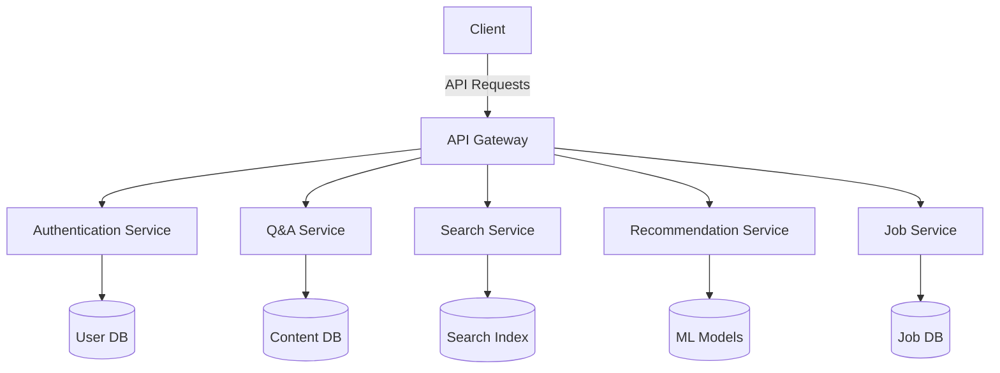

# AskAfrica Q&A Platform


A community-driven platform designed to bridge the knowledge-sharing gap within African communities through inclusivity, multilingual support, and innovative features.

## Table of Contents

1. [Introduction](#introduction)
2. [Vision and Mission](#vision-and-mission)
3. [Key Features](#key-features)
4. [Tech Stack](#tech-stack)
5. [Architecture Overview](#architecture-overview)
6. [Setup Instructions](#setup-instructions)
7. [Running the Application](#running-the-application)
8. [Testing](#testing)
9. [Deployment](#deployment)
10. [Contributing](#contributing)
11. [Community and Support](#community-and-support)
12. [Roadmap](#roadmap)
13. [Screenshots](#screenshots)
14. [Awards and Recognition](#awards-and-recognition)
15. [License](#license)
16. [Acknowledgements](#acknowledgements)

## Introduction

AskAfrica is a revolutionary Q&A platform designed to address the lack of localized, culturally relevant knowledge-sharing platforms in Africa. By leveraging cutting-edge technology and a deep understanding of African communities, AskAfrica aims to empower individuals across the continent with access to valuable information and expertise.

Our platform supports multiple languages, allowing users to interact in their native tongues, fostering inclusivity and community empowerment. Whether you're a student seeking academic guidance, a professional looking for industry insights, or simply curious about African culture and traditions, AskAfrica is your go-to resource for authentic, community-driven knowledge.

## Vision and Mission

### Vision
To become the premier knowledge-sharing platform for Africa, connecting minds across the continent and diaspora, and fostering a culture of collaborative learning and innovation.

### Mission
Our mission is to:
- Bridge the information gap in African communities
- Promote cross-cultural understanding and knowledge exchange
- Empower African voices and expertise
- Facilitate access to quality, localized information
- Foster a spirit of curiosity, learning, and mutual support

## Key Features

AskAfrica offers a rich set of features designed to enhance user experience and facilitate knowledge sharing:

### 1. Multilingual Support
- Support for over 100 African languages
- Automatic translation of questions and answers
- Language preference settings for user profiles

### 2. Intuitive Q&A System
- Ask and answer questions with ease
- Rich text editor with support for images and formatting
- Tag questions with relevant topics for easy discovery

### 3. Community Engagement
- Upvote, downvote, and save questions for later
- Comment threads for in-depth discussions
- @mention functionality to involve specific users

### 4. Code Snippet Integration
- Include code snippets with syntax highlighting
- Support for multiple programming languages
- Executable code blocks for interactive learning

### 5. Advanced Search and Filters
- Search questions by keywords, tags, or categories
- Filter results by date, popularity, or user reputation
- Personalized search results based on user interests

### 6. User Profiles and Reputation System
- Customizable user profiles showcasing expertise and contributions
- Reputation points earned through quality contributions
- Badges and achievements to recognize user milestones

### 7. Content Recommendation
- AI-powered question recommendations based on user activity
- "Related Questions" feature to explore similar topics
- Daily digest emails with personalized content suggestions

### 8. Mobile Responsiveness
- Fully responsive design for seamless mobile usage
- Native mobile apps for iOS and Android (coming soon)

### 9. Offline Support
- Progressive Web App (PWA) functionality for offline access
- Sync capabilities to update content when back online

### 10. Integration with African Job Market
- Explore and filter job opportunities by location or category
- Direct application process for listed jobs
- Company profiles and reviews from community members

### 11. Accessibility Features
- High-contrast mode for visually impaired users
- Screen reader compatibility
- Keyboard navigation support

### 12. Community Moderation
- User-driven moderation system
- Flagging mechanism for inappropriate content
- Trusted user program for community leaders

## Tech Stack

AskAfrica leverages a modern and robust tech stack to deliver a seamless user experience:

### Frontend
- **Framework**: Next.js 14 with TypeScript
- **UI Components**: React Icons, Shadcn UI
- **Styling**: Tailwind CSS for responsive design
- **State Management**: Redux Toolkit
- **Forms**: React Hook Form with Zod validation

### Backend
- **Database**: MongoDB with Mongoose ODM
- **API**: GraphQL with Apollo Server
- **Authentication**: Clerk for secure user management
- **Search**: Elasticsearch for fast and accurate searches
- **Caching**: Redis for improved performance

### DevOps & Infrastructure
- **Deployment**: Vercel for seamless deployments
- **CI/CD**: GitHub Actions for automated testing and deployment
- **Monitoring**: Sentry for error tracking and performance monitoring
- **Analytics**: Mixpanel for user behavior analysis

### Additional Technologies
- **Rich Text Editing**: TinyMCE editor
- **Code Highlighting**: PrismJS
- **Internationalization**: next-i18next for multilingual support
- **Job Search**: Integration with JSearch API
- **AI & Machine Learning**: TensorFlow.js for content recommendations

## Architecture Overview

AskAfrica follows a microservices architecture to ensure scalability and maintainability:



This architecture allows us to:
- Scale individual services based on demand
- Implement new features without affecting the entire system
- Ensure high availability and fault tolerance

## Setup Instructions

### Prerequisites

Ensure you have the following installed:
- Node.js (version 14 or above)
- npm or yarn package manager
- Git
- MongoDB (local instance or cloud service)
- Redis (for caching)

### Installation

1. Clone the repository:
```bash
git clone https://github.com/your-username/askafrica.git
cd askafrica
```

2. Install dependencies:
```bash
npm install
```

3. Set up environment variables:
   Create a `.env.local` file in the root directory and add the following variables:

```plaintext
# App
NEXT_PUBLIC_APP_URL=http://localhost:3000

# Database
MONGODB_URI=your_mongodb_connection_string

# Authentication
NEXT_PUBLIC_CLERK_PUBLISHABLE_KEY=your_clerk_publishable_key
CLERK_SECRET_KEY=your_clerk_secret_key

# API Keys
OPENAI_API_KEY=your_openai_api_key
NEXT_PUBLIC_TINY_EDITOR_API_KEY=your_tiny_editor_api_key
NEXT_PUBLIC_RAPID_API_KEY=your_rapid_api_key

# Webhooks
NEXT_CLERK_WEBHOOK_SECRET=your_clerk_webhook_secret

```

Replace `your_*` placeholders with your actual credentials.

### API Keys Setup

1. **Clerk Authentication**:
   - Sign up at [Clerk](https://clerk.com/)
   - Create a new application
   - Copy your API keys from the dashboard
   - Configure OAuth providers if needed

2. **OpenAI API**:
   - Sign up at [OpenAI](https://openai.com/)
   - Generate an API key in your account settings

3. **TinyMCE Editor**:
   - Sign up at [TinyMCE](https://www.tiny.cloud/)
   - Obtain your API key from the dashboard

4. **RapidAPI (for JSearch)**:
   - Sign up at [RapidAPI](https://rapidapi.com/)
   - Subscribe to the JSearch API
   - Copy your API key

### Database Setup

1. **MongoDB**:
   - Set up a MongoDB cluster (local or cloud service like MongoDB Atlas)
   - Obtain your connection string
   - Add the connection string to your `.env.local` file

### Webhook Configuration

1. In the Clerk dashboard, create a new webhook endpoint
2. Set the Endpoint URL to `https://your-app-url.com/api/webhooks/clerk`
3. Select the required events (e.g., user.created, user.updated)
4. Copy the Webhook Secret to your `.env.local` file

### Local Development with ngrok

To test webhooks locally:

1. Install [ngrok](https://ngrok.com/download)
2. Start your local server:
```bash
npm run dev
```

3. In a new terminal window, start ngrok:
```bash
ngrok http 3000
```

4. Update the webhook URL in the Clerk dashboard with the ngrok URL
5. Update `NEXT_PUBLIC_APP_URL` in `.env.local` with the ngrok URL

## Running the Application

To start the development server:

```bash
npm run dev
```

Visit `http://localhost:3000` in your browser to see the application.

For production:

```bash
npm run build
npm start
```

## Testing

AskAfrica uses Jest for unit and integration tests, and Cypress for end-to-end testing.

To run unit and integration tests:

```bash
npm run test
```

To run end-to-end tests:

```bash
npm run test:e2e
```

## Deployment

AskAfrica is configured for deployment on Vercel. To deploy:

1. Push your code to a GitHub repository
2. Connect your repository to Vercel
3. Configure your environment variables in the Vercel dashboard
4. Deploy the application

For other hosting providers, ensure you set up the necessary environment variables and build commands as specified in the `package.json` file.

## Screenshots


*Homepage of AskAfrica showcasing trending questions and categories*


*Detailed Question Page with answers, comments, and related questions*


*User Profile Page displaying achievements, contributions, and activity feed*


*Mobile-responsive view of AskAfrica, ensuring seamless usage on smartphones*


*Dark mode option for comfortable nighttime browsing*

## License

This project is licensed under the MIT License. See the [LICENSE](LICENSE) file for details.

## Acknowledgements

We would like to thank the following organizations and projects that have made AskAfrica possible:

- [Next.js](https://nextjs.org/) for the amazing React framework
- [Vercel](https://vercel.com/) for their superb hosting and deployment platform
- [MongoDB](https://www.mongodb.com/) for the robust and scalable database solution
- [Clerk](https://clerk.dev/) for simplified user authentication and management
- [TinyMCE](https://www.tiny.cloud/) for the powerful rich text editor
- [Tailwind CSS](https://tailwindcss.com/) for the utility-first CSS framework
- All our open-source dependencies and their maintainers
- The amazing African developer community for their continuous support and feedback

---

Built with ❤️ by the AskAfrica Team

For any questions or support, please open an issue in the GitHub repository or contact our support team at [mayalaplamedi.rw@gmail.com](mailto:mayalaplamedi.rw@gmail.com).